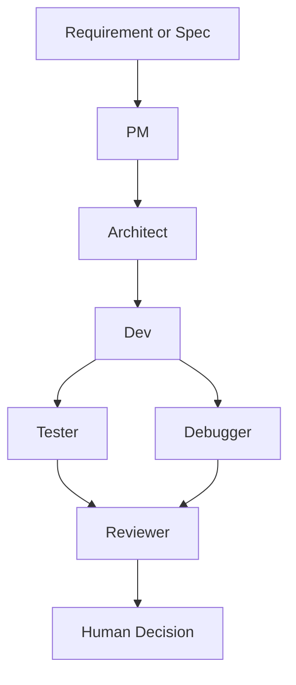

# Maestro Flow

面向代码交付场景的多 Agent CLI 工作流。

你负责最终评审和交付决策，Maestro Flow 负责把需求拆解、方案设计、开发建议、测试建议、调试分析和评审输出，组织成一条可运行、可审查、可追溯的本地交付流程。

## 它是什么

Maestro Flow 是一个独立开源 CLI 工具，用来把 AI 参与的软件交付过程收敛成：

- 可运行：通过 CLI 执行固定的多 Agent 流程
- 可审查：每个阶段都有结构化产物
- 可追溯：每次运行都会落盘到 `.maestro/runs/<run_id>/`
- 可治理：支持策略门禁、CI 评估和 PR 评论

默认工作流：



## 快速开始

### 1. 安装

```bash
python -m venv .venv
# Windows
.venv\Scripts\activate
pip install -e .
```

如果你要跑测试：

```bash
pip install -e ".[test]"
```

### 2. 配置环境变量

复制 `.env.example` 为 `.env`，至少配置以下之一：

- `MAESTRO_API_KEY` + `MAESTRO_PROVIDER`
- 或 provider 专用 key，例如 `OPENAI_API_KEY`

可选配置：

- `MAESTRO_BASE_URL`
- `MAESTRO_MODEL`

查看当前内置 provider：

```bash
python -m maestro_flow.cli providers
```

### 3. 先跑一遍 mock

```bash
python -m maestro_flow.cli run --mock --requirement "构建一个可审查的多 Agent 开发流程"
```

### 4. 再跑真实需求

```bash
python -m maestro_flow.cli run --requirement "实现一个支持排序和分页的可复用表格组件"
```

### 5. 看结果

每次运行都会输出：

- `run_id`
- `run_dir`
- `summary`

最推荐先看：

- `summary.md`：总览结论
- `run_state.json`：运行状态、阶段状态、错误码
- `policy_report.json`：策略门禁结果

## 核心命令

### Requirement 驱动

```bash
python -m maestro_flow.cli run --requirement "实现一个支持排序和分页的可复用表格组件"
```

本地 mock：

```bash
python -m maestro_flow.cli run --mock --requirement "验证流程"
```

### Spec 驱动

初始化 spec：

```bash
python -m maestro_flow.cli spec init --name "react-table-feature"
```

按 spec 执行：

```bash
python -m maestro_flow.cli spec run --file .maestro/specs/<your-spec>.md
```

### CI 与 PR

评估最新一次运行：

```bash
python -m maestro_flow.cli ci evaluate
```

评估指定运行：

```bash
python -m maestro_flow.cli ci evaluate --run-id <run_id>
```

向 PR 写入或更新评论：

```bash
python -m maestro_flow.cli ci comment --run-id <run_id> --pr-number <pr_number>
```

### Git 交付

```bash
python -m maestro_flow.cli finalize \
  --run-id <run_id> \
  --branch feat/xxx \
  --commit-message "feat: apply maestro output"
```

## JSON 输出

如果你要把 CLI 接到脚本、CI 或其他宿主工具里，可以给关键命令加 `--json`，拿到机器可读结果。

示例：

```bash
python -m maestro_flow.cli run \
  --requirement "实现用户列表筛选" \
  --mock \
  --skip-gates \
  --json
```

输出示例：

```json
{
  "ok": true,
  "command": "run",
  "run_id": "20260430-013547-335-6dd4b4",
  "run_dir": "D:/Project/test-project/multi-agent/.maestro/runs/20260430-013547-335-6dd4b4",
  "verdict": "approve_with_conditions",
  "summary_file": "D:/Project/test-project/multi-agent/.maestro/runs/20260430-013547-335-6dd4b4/summary.md"
}
```

当前已支持 `--json` 的命令：

- `run`
- `spec run`
- `install`
- `ci evaluate`
- `sync-back plan`
- `sync-back apply`

设计原则很简单：

- 默认输出继续面向人看
- `--json` 只在你明确需要脚本集成时启用
- JSON 输出带退出码，方便宿主判断成功或失败

## 宿主集成

Maestro Flow 的产品本体是 CLI，不同宿主通过模板或 skill 接入。

安装集成模板：

```bash
python -m maestro_flow.cli install --target <target> --scope <project|user>
```

当前支持目标：

- `claude`
- `cursor`
- `opencode`
- `antigravity`
- `codex`

说明：

- `claude`、`cursor`、`opencode`、`antigravity`：安装 slash command 模板
- `codex`：安装 skills 到项目级 `.agents/skills` 或用户级 `~/.agents/skills`

如果宿主使用自定义目录，可以手动指定 `--dest`。

## 文档索引

- `docs/MVP_definition.md`：当前 MVP 定义
- `docs/support_matrix.md`：宿主、provider 与能力边界
- `docs/validated_setups.md`：已验证的宿主与 provider 组合
- `docs/real_world_regression_samples.md`：真实项目回归样本
- `docs/release_regression_checklist.md`：发布前回归检查清单
- `docs/release_checklist.md`：开源首发检查清单
- `docs/codex_integration_roadmap.md`：Codex 适配路线

进阶实现说明保留在 `docs/` 下，不放在 README 里堆叠。

## 项目结构

- `agents/agents.yaml`：Agent 配置
- `agents/prompts/*.md`：阶段提示词
- `src/maestro_flow/orchestrator.py`：流程编排器
- `src/maestro_flow/providers.py`：provider 解析
- `src/maestro_flow/integrations.py`：宿主集成安装逻辑
- `integrations/*`：slash command / skill 模板
- `.maestro/runs/<run_id>/`：运行产物目录

## 开发与测试

运行测试：

```bash
pytest -q
```

构建包：

```bash
python -m build
```

## 开源信息

- License: `MIT`
- Contribution guide: `CONTRIBUTING.md`
- Change log: `CHANGELOG.md`
