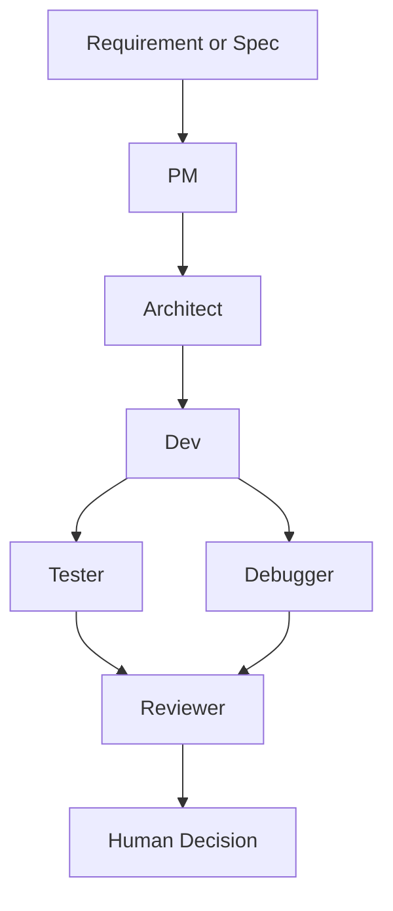

# Maestro Flow

面向代码交付场景的多 Agent CLI 工作流。

你负责最终 review 与交付决策，系统负责需求拆解、方案设计、开发建议、测试建议、调试分析与评审输出。

## 它是什么

Maestro Flow 是一个独立的开源 CLI 工具，用来把 AI 参与的软件交付过程变成：

- 可运行：通过 CLI 执行固定的多 Agent 流程
- 可审查：每个阶段输出结构化结果
- 可追溯：每次运行都落盘到 `.maestro/runs/<run_id>/`
- 可治理：支持策略门禁、CI 评估和 PR 评论

默认工作流：



## 第一次使用只看这里

### 1. 安装

```bash
python -m venv .venv
# Windows
.venv\Scripts\activate
pip install -e .
```

如果你要跑测试：

```bash
pip install -e ".[test]"
```

### 2. 配置环境变量

先复制 `.env.example` 为 `.env`。

至少配置以下之一：

- `MAESTRO_API_KEY` + `MAESTRO_PROVIDER`
- 或 provider 专用 key，例如 `OPENAI_API_KEY`

可选：

- `MAESTRO_BASE_URL`
- `MAESTRO_MODEL`

查看支持的 provider：

```bash
python -m maestro_flow.cli providers
```

当前内置：

- `openai`
- `openrouter`
- `deepseek`
- `moonshot`
- `qwen`
- `siliconflow`
- `volcengine`
- `custom`

### 3. 先跑一次 mock

```bash
python -m maestro_flow.cli run --mock --requirement "构建一个可审查的多 Agent 开发流程"
```

### 4. 再跑一次真实 requirement

```bash
python -m maestro_flow.cli run --requirement "实现一个支持排序和分页的可复用表格组件"
```

### 5. 跑完先看哪里

每次运行都会输出：

- `run_id`
- `run_dir`
- `summary`

最推荐先看：

- `summary.md`：总览结论
- `run_state.json`：运行状态、阶段状态、错误码
- `policy_report.json`：策略门禁结果

## 默认主路径

当前版本推荐的新用户路径是：

1. 运行 `run --mock` 验证本地环境
2. 运行真实 `run` 或 `spec run`
3. 查看 `.maestro/runs/<run_id>/summary.md`
4. 基于 reviewer、policy、CI 结果做人工决策

这条主路径强调的是：

- 流程清晰
- 产物可审查
- 结果可追溯
- 最终决策有人控

自动改代码、自动执行命令、隔离执行与回写等能力已经支持，但属于进阶工作流，不是第一次上手的必经路径。

## 核心命令

### Requirement 驱动

```bash
python -m maestro_flow.cli run --requirement "实现一个支持排序和分页的可复用表格组件"
```

本地 mock：

```bash
python -m maestro_flow.cli run --mock --requirement "验证流程"
```

### Spec 驱动

初始化 spec：

```bash
python -m maestro_flow.cli spec init --name "react-table-feature"
```

按 spec 执行：

```bash
python -m maestro_flow.cli spec run --file .maestro/specs/<your-spec>.md
```

### CI 与 PR

评估最新一次运行：

```bash
python -m maestro_flow.cli ci evaluate
```

评估指定运行：

```bash
python -m maestro_flow.cli ci evaluate --run-id <run_id>
```

向 PR 写入或更新评论：

```bash
python -m maestro_flow.cli ci comment --run-id <run_id> --pr-number <pr_number>
```

### Git 交付

```bash
python -m maestro_flow.cli finalize \
  --run-id <run_id> \
  --branch feat/xxx \
  --commit-message "feat: apply maestro output"
```

如果已安装 `gh`，可加 `--pr` 自动创建 PR。

## 宿主集成

Maestro Flow 的产品本体是 CLI。  
不同宿主的支持通过模板或 skill 接入完成。

安装集成模板：

```bash
python -m maestro_flow.cli install --target <target> --scope <project|user>
```

当前支持目标：

- `claude`
- `cursor`
- `opencode`
- `antigravity`
- `codex`

说明：

- `claude`、`cursor`、`opencode`、`antigravity`：安装 slash command 模板
- `codex`：安装 skills 到项目级 `.agents/skills` 或用户级 `~/.agents/skills`
  - 当前包含：`maestro-spec`、`maestro-run`
- Codex 宿主内有内置 slash commands，但当前仓库的可复用工作流通过 skills 接入

如果宿主使用自定义目录，可手动指定 `--dest`。

## 高级能力

以下能力已经实现，但建议在熟悉默认主路径后再使用：

- 回滚策略
- 知识库注入、提示词版本化、策略门禁
- 策略插件与 PR 策略明细
- 执行闭环：自动改代码、自动测试、自动修复
- 隔离执行与 sync-back 回写
- 人工决策式回写冲突处理

这些能力的详细说明、配置示例和产物说明，统一收敛到 `docs/` 目录。

## 文档索引

- `docs/MVP_definition.md`：当前 MVP 定义
- `docs/support_matrix.md`：宿主、provider 与能力支持边界
- `docs/codex_integration_roadmap.md`：Codex 适配增强路线
- `docs/validated_setups.md`：当前已验证的宿主与 provider 组合
- `docs/real_world_regression_samples.md`：真实项目回归样本
- `docs/release_regression_checklist.md`：发布前回归检查清单
- `docs/release_checklist.md`：开源首发最终检查清单
- `docs/P0_P1_implementation.md`：状态机、重试、DAG、并行执行
- `docs/P3_rollback.md`：回滚策略
- `docs/P4_知识库_提示词版本化_策略门禁.md`：知识库、提示词版本化、策略门禁
- `docs/P5_策略插件化_与PR策略明细.md`：策略插件化与 PR 策略明细
- `docs/P6_执行闭环_自动改代码_自动测试_自动修复.md`：执行闭环、隔离执行、回写

## 项目结构

- `agents/agents.yaml`：Agent 配置
- `agents/prompts/*.md`：阶段提示词
- `src/maestro_flow/orchestrator.py`：编排器
- `src/maestro_flow/providers.py`：多 provider 解析
- `src/maestro_flow/integrations.py`：集成安装逻辑
- `scripts/maestro.ps1`：PowerShell 快捷命令
- `integrations/*`：slash command / skill 模板
- `.maestro/runs/<run_id>/`：运行产物目录

## 开源信息

- License: `MIT`
- Contribution guide: `CONTRIBUTING.md`
- Change log: `CHANGELOG.md`
